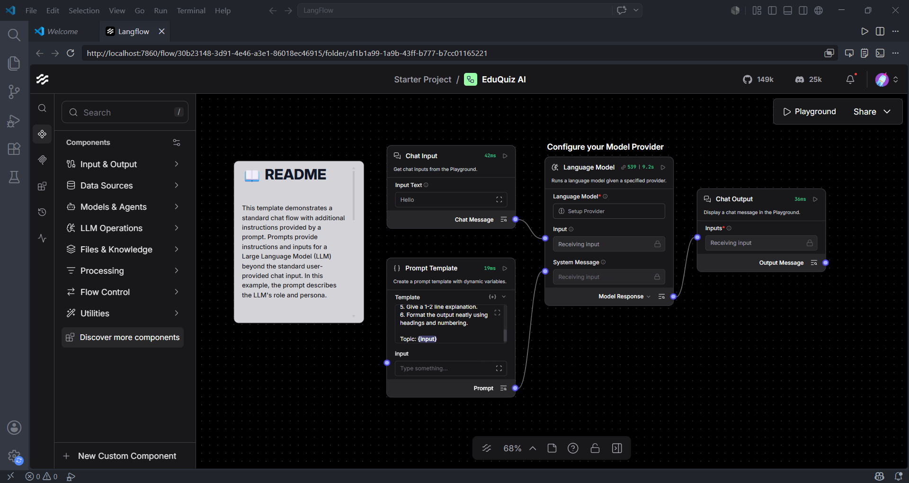
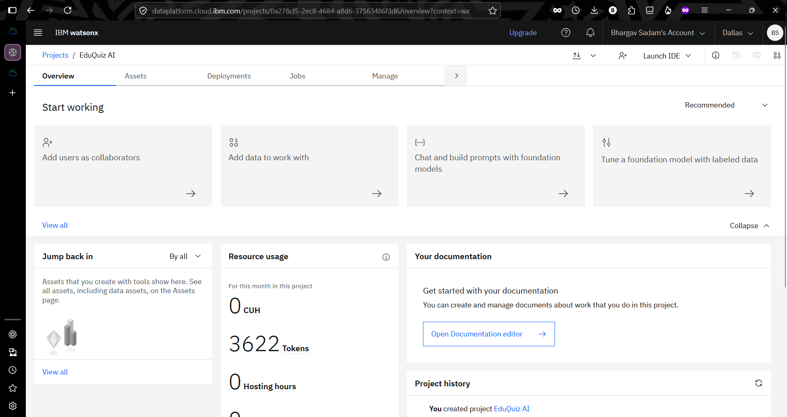
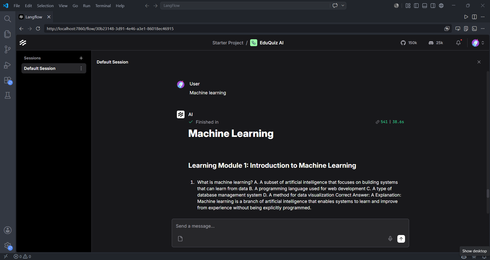

# EduQuiz AI

## Overview
EduQuiz AI is an AI-powered syllabus quiz generator built using IBM watsonx.ai, IBM Granite Models, and LangFlow.

The system generates:
- Learning Modules
- Multiple Choice Questions (MCQs)
- Correct Answers
- Explanations

from any educational topic automatically.

## Tech Stack
- IBM watsonx.ai
- IBM Granite Foundation Models
- LangFlow
- Python
- Prompt Engineering

## Features
- Automated Quiz Generation
- Learning Module Creation
- Answer Generation
- Explanation Generation
- Multi-subject Support

## Architecture

User Input
    ↓
LangFlow Workflow
    ↓
Prompt Template
    ↓
IBM watsonx.ai
    ↓
IBM Granite Foundation Model
    ↓
Learning Modules + MCQs + Answers + Explanations

## Screenshots

### LangFlow Workflow

### IBM watsonx.ai Prompt Lab

### Generated Output

## Future Scope

- PDF and DOCX export support
- Adaptive learning recommendations
- Multi-language quiz generation
- Difficulty-level customization
- LMS integration

## Author

Bhargav Sadam

## IBM SkillsBuild Project

This project was developed as part of the IBM SkillsBuild / watsonx.ai learning initiative.